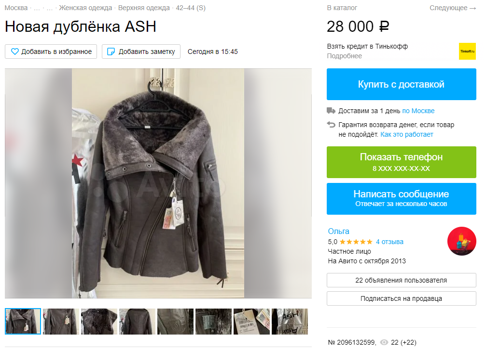

## Отсутствие кнопки «Купить с доставкой» на странице товара из категории «Личные вещи с доставкой»
### _Присутствует не на всех страницах, логика не очевидна_

### Шаги воспроизведения
1) Открыть страницу https://www.avito.ru/moskva/lichnye_veschi?cd=1&d=1
2) Выбрать одно из представленных объявлений

### Ожидаемый результат: 
На странице присутствуют кнопка «Купить с доставкой» (скриншот 1)
### Фактический результат: 
Кнопка «Купить с доставкой» отсутствует (скриншот 2)

### Окружение
Win10, Google Chrome (88.0.4324.190) 
Win10, Яндекс Браузер (21.2.1.107) 
Win10, Opera (74.0.3911.160) 
Win10, Microsoft Edge (88.0.705.81) 

### Приоритет
Незначительный / низкий  
Создает неудобства при заказе (См. UPD)

### UPD:
Через некоторое время кнопка появляется.  
Однако поведение некорректное, так как в разделе "Вещи с доставкой" 
нет возможности оформить заказ сразу после добавления.   
Случай отличен от ситуации, когда присутствует сообщение 
"Объявление находится на рассмотрении у модераторов"  

### UPD2:
Появляется ли кнопка у всех объявлений или только у части не понятно, 
так как максимальная страница поиска - 100. На ней размещены объявления, 
созданные чуть более часа назад. Среди них также было объявление без 
кнопки «Купить с доставкой»

### Доп материалы
####Скриншот 1

####Скриншот 2

####Скриншот 3
